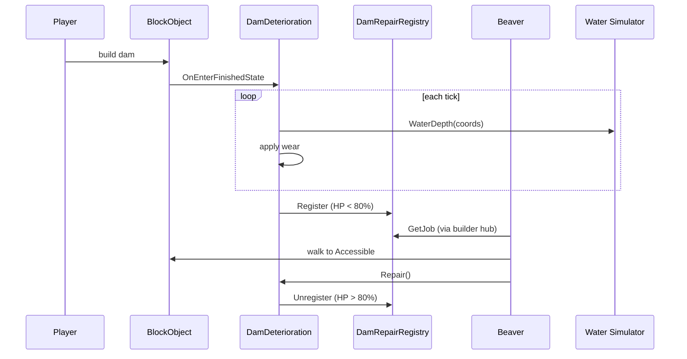

# Damn Dam Degradation

Dams, levees, and floodgates (single, double, triple) in vanilla Timberborn are eternal. With this mod they take **Hydro-Stress** damage proportional to the water depth they hold back. Players who neglect maintenance get warned, then visibly leak, then breach. Builder beavers walk over and repair them.

## What changes

- A `DamDeteriorationSpec` is added to dam, levee, and floodgate (single/double/triple) Folktails blueprints (overlays in `Data/Buildings/Landscaping/`).
- Every block gets a `DamDeterioration` component that ticks while finished and applies water-driven wear.
- A status icon appears once health drops below 80%; a red alert + map notification appear below 30%.
- Below 30% the dam **leaks** via the same engine API the Throttling Valve uses (`IWaterService.SetInflowLimit`): water genuinely flows through the dam from upstream to downstream at a rate that scales with damage. Conservation, flow vectors and contamination are handled by the engine.
- At 0 HP the entity is deleted, the vanilla water sim breaches the wall, and adjacent dam blocks take 25 cascade damage. Anything stacked above the failed block also collapses.
- Builder beavers automatically pick up repair jobs via the standard builder hub system.

## Damage formula

```
wearPerDay     = (BaseWearPerDay + StressWearCoefficient * waterDepth ^ StressExponent)
                 * supportFactor
                 * GlobalWearMultiplier
                 * (1 + RNG[-variance, +variance])
healthDelta    = wearPerDay * (FixedDeltaTimeInHours / 24)
```

`supportFactor` is `DownstreamSupportFactor` (0.5 by default) when a dam block sits directly downstream along the local flow vector, otherwise `1.0`. Building dams two blocks deep in the flow direction roughly doubles their lifetime.

With the default coefficients (`Coef=0.09`, `Exp=1.5`, `Base=0`):

| Water depth | wear/day | days to failure (100 HP, no support) | with support (×0.5) |
|---|---|---|---|
| 1 m | 0.09 | 1100 | 2200 |
| 3 m | 0.47 | 215 | 430 |
| 5 m | 1.0 | 100 | 200 |
| 8 m | 2.0 | 50 | 100 |
| 10 m | 2.85 | 35 | 70 |

Small ponds basically last forever. Mid-depth reservoirs need attention every couple of in-game seasons. Mega-dams are scary.

## Per-blueprint tuning

All tunables live in `Data/Buildings/*.blueprint.json`. Adjust per building without recompiling:

| Field | Meaning |
|---|---|
| `MaxHealth` | Maximum HP per block. |
| `BaseWearPerDay` | HP/day lost regardless of water. Default 0 (no rain decay). |
| `StressWearCoefficient` | Multiplier on the stress curve. |
| `StressExponent` | Power of waterDepth. >1 = deep water disproportionately worse. |
| `DownstreamSupportFactor` | Wear multiplier when supported downstream. Lower = more support benefit. |
| `WarningHealthFraction` | UI turns yellow + auto-queues a repair job below this. |
| `CriticalHealthFraction` | UI turns red, dam starts leaking, alert posted below this. |
| `RepairAmount` | HP restored per repair action. |
| `CascadeDamage` | HP knocked off each adjacent dam block when this one breaches. |

Defaults vary by building:
- **Dam** — coefficient 0.09, MaxHealth 100, RepairAmount 25 (the baseline).
- **Levee** — coefficient 0.07, MaxHealth 80, RepairAmount 20 (smaller block, lower load assumption).
- **Floodgate** — coefficient 0.12, MaxHealth 120, RepairAmount 30 (mechanical, more failure-prone).
- **DoubleFloodgate** — coefficient 0.12, MaxHealth 140, RepairAmount 35.
- **TripleFloodgate** — coefficient 0.12, MaxHealth 160, RepairAmount 40.

## Mod-wide settings

Open the **Mods** menu (main menu or in-game), click the cog button on this mod's card, and you get a panel with sliders and toggles for:

| Setting | Default | What it does |
|---|---|---|
| Enable degradation | on | Master switch. Off = mod loads but no wear is applied. |
| Wear speed (%) | 100 | Multiplier on every block's per-spec wear. Lower = dams last longer. |
| Random variance (%) | 15 | Per-tick spread around the computed wear (0 = deterministic). |
| Repair time (in-game hours) | 4 | Time a beaver spends per repair before productivity multipliers. |
| Repair cost (planks) | 0 | Reserved for a future material-cost variant; currently ignored. |
| Instant repair button (debug) | off | When on, the entity panel button repairs instantly without a beaver. |

Settings are persisted by Timberborn's vanilla `ISettings` (Unity `PlayerPrefs`) so they apply to every save and survive restarts. Changes take effect immediately because the mod reads each value lazily on access — no restart required.

The settings UI is provided by the [Mod Settings](https://steamcommunity.com/sharedfiles/filedetails/?id=3283831040) helper mod (`eMka.ModSettings`), which is declared as a required dependency in `manifest.json`. The Steam Workshop / mod manager will install it automatically.

## Repair flow

When a dam crosses below `WarningHealthFraction`:

1. A yellow status icon appears above the block.
2. The dam joins the global `DamRepairRegistry`.
3. The next free builder beaver picks up the closest pending dam via `DamRepairJobProvider` (registered as an `IBuilderJobProvider` with priority 0 — the builder hub iterates providers ascending and the first one to return a job wins, so a value below the vanilla `BuildingJobProvider` (priority 1) means dam repair preempts new constructions).
4. The beaver walks to the dam (`WalkToAccessibleExecutor`), plays the building animation, and ticks down `RepairTimeInHours` worth of work.
5. On completion `DamDeterioration.Repair()` restores `RepairAmount` HP and unregisters from the queue.

Repair time scales with `Worker.WorkingSpeedMultiplier`, so productivity bonuses (Inventor, Innovator's Outlet, etc.) speed up dam repair the same way they speed up vanilla construction.

The entity-panel button is a manual override:
- If `AllowInstantRepair` is on, it instantly repairs (debug).
- Otherwise it toggles whether the dam is in the auto-repair queue, in case the player wants to defer the work.

While a beaver has the dam reserved, the button switches to "Repair in progress" and is disabled.

## Architecture

```
Scripts/
├── Configuration/
│   ├── DamDegradationConfigurator.cs   # Bindito wiring, decorators, providers + settings registration
│   └── DamDegradationModStarter.cs     # IModStarter entry point
├── Components/
│   ├── DamDeteriorationSpec.cs         # ComponentSpec data record (per-blueprint tuning)
│   ├── DamDeterioration.cs             # Per-block tick component (degradation, leakage, status)
│   └── IDamDeteriorationListener.cs    # Visual / audio extension point
├── Core/
│   └── DamSettings.cs                  # Mod-wide tuning, exposed as an eMka ModSettingsOwner
├── Repair/
│   ├── DamRepairRegistry.cs            # Set of dams that need a builder
│   ├── DamRepairReservation.cs         # Per-dam single-builder lock
│   ├── DamRepairBehavior.cs            # Beaver-side: reserve, walk, run executor
│   ├── DamRepairExecutor.cs            # Beaver-side: countdown + animation + Repair()
│   └── DamRepairJobProvider.cs         # IBuilderJobProvider plugged into the builder hub
├── UI/
│   └── DamHealthFragment.cs            # Entity-panel HP bar + Repair button
Data/
├── Buildings/                          # Spec overlays for Dam, Levee, Floodgate, DoubleFloodgate, TripleFloodgate
└── Localizations/enUS_DamDegradation.csv
docs/
└── api-cheatsheet.md                   # Timberborn APIs this mod touches, by file path
```

### Component lifecycle



## Build

Standard Timberborn Unity mod. Open the project in Unity, the asmdef `DamDegradationMod` compiles into a DLL. Drop the DLL next to `manifest.json` and the `Data/` folder in `<Timberborn>/Mods/DamnDamDegradation/`.

The asmdef references `ModSettings.Core` and `ModSettings.Common` from the **Mod Settings** helper mod. To compile in Unity you also need the eMka.ModSettings source folder somewhere in your `Assets/`:

```powershell
# from the workspace root
git clone --depth 1 https://github.com/eMkaQQ/timberborn-modding `
    Assets/Mods/ModSettings.Source
# Unity will pick up Assets/Mods/ModSettings.Source/Assets/Mods/ModSettings/Scripts/**/*.asmdef
```

Players don't need this — they only need to subscribe to the [Mod Settings](https://steamcommunity.com/sharedfiles/filedetails/?id=3283831040) workshop item, and the game's mod manager wires it up automatically because `manifest.json` declares the dependency.

## Coverage

The mod overlays `DamDeteriorationSpec` onto these vanilla Folktails blueprints:

```
Data/Buildings/Landscaping/Dam/Dam.Folktails.blueprint.json
Data/Buildings/Landscaping/Levee/Levee.Folktails.blueprint.json
Data/Buildings/Landscaping/Floodgate/Floodgate.Folktails.blueprint.json
Data/Buildings/Landscaping/DoubleFloodgate/DoubleFloodgate.Folktails.blueprint.json
Data/Buildings/Landscaping/TripleFloodgate/TripleFloodgate.Folktails.blueprint.json
```

IronTeeth water buildings (Sluice, Fill Valve, Throttling Valve) are intentionally **not covered** because they're metal-tier infrastructure with their own balance assumptions.

## Design notes

### v1 is a labor-cost mod, not a material-cost mod

By design, repairs **don't consume planks**. The cost is your builders' time. A megadam that's constantly degrading ties up your build queue — that *is* the cost, and it's already a real one in a game where labor is finite. Adding a plank cost on top would either be too cheap to matter (1 plank per repair) or so heavy that early settlements get locked out of dam maintenance entirely. We chose the labor-only model so the mod stays robust on day-1 playthroughs and on hard difficulties without a Lumber Mill.

`RepairCostInPlanks` is in `DamSettings` as a forward-compatibility hook; the executor doesn't read it yet. If a future version wants material costs, the integration point is `DamRepairExecutor.FinishWith(Success)`.

A "Repair Kit" workshop building is intentionally **out of scope** for this mod. It would be a clean follow-up as a separate companion mod that requires this one.

## Known limitations

- **No custom art.** The status icons reuse vanilla `LackOfResources` (yellow, used by Workshops out-of-resources status) and `GenericError` (red, used by the duplicate-name alert). The block itself gets a runtime tint (yellow at warning, red at critical) via `DamDamageVisuals` using a `MaterialPropertyBlock` — no asset bundle, no PNG dependency. Real damaged textures can be wired by replacing the tint logic with texture swaps; see `Placeholders/Art/README.md`.
- **No in-game settings UI for per-blueprint tuning.** The eMka panel is global; per-block coefficients still live in `Data/Buildings/*.blueprint.json` and require a save reload to change. That's intentional — per-building values are typically a modder-side balance choice rather than a player choice.
- **`Tier 2` (beaver builder integration) is unverified empirically.** The patterns follow the vanilla `BuildBehavior` / `BuildExecutor` / `BuildingJobProvider` triple from `Timberborn.ConstructionSites` exactly, and the public API surface is documented. I can't run the game from this workspace, so first-playtest issues will likely cluster around district boundaries (a builder in district A picking a dam in district B), beavers becoming temporarily trapped if the dam's `Accessible` flickers during the breach animation, and ordering interactions with other mods that also register an `IBuilderJobProvider`. None of these are architectural; they're tuning bugs.
- **Save/load mid-repair.** `DamRepairBehavior` persists a `ReferenceSerializer`-encoded reference to the reserved dam and re-acquires the reservation in `PostInitializeEntity`; `DamRepairExecutor` re-uses the saved finish timestamp via `InitializeAfterLoad`. Loads where the reserved dam was deleted between save and load are dropped silently and the beaver returns to idle.
- **Save compatibility.** Save data uses `ComponentKey("DamDeterioration")`. Mod-wide settings are stored in `PlayerPrefs` under keys derived from the mod id and property name (handled by `ModSettingsOwner`), not in the save game itself. Future versions should bump the component key or add `BackwardCompatible` markers to migrate.

## See also

- `docs/api-cheatsheet.md` — the Timberborn APIs this mod uses, with file paths into `TimberbornRef/`.
